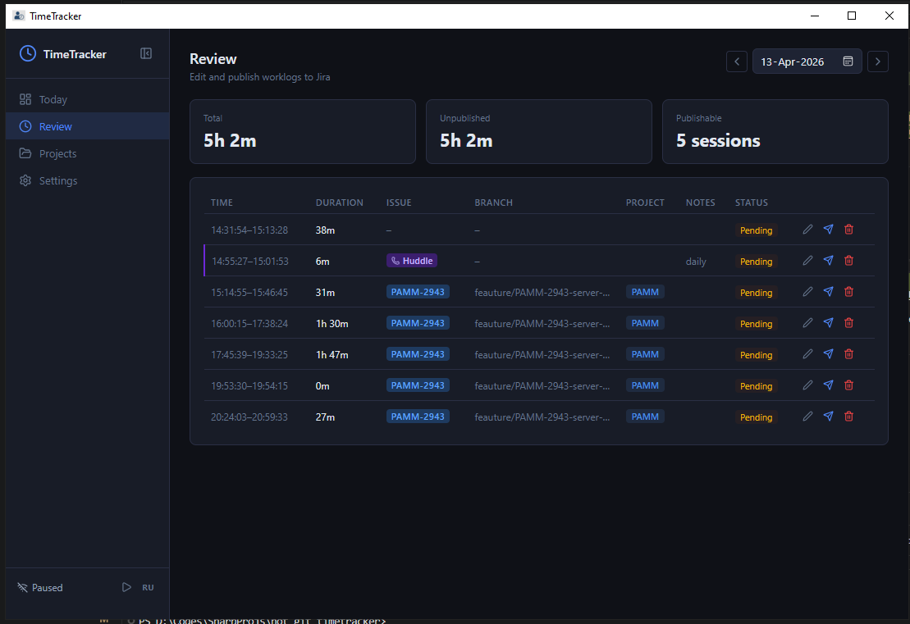

# TimeTracker

> **[github.com/kitakun/TimeTracker](https://github.com/kitakun/TimeTracker)**

A lightweight, privacy-first desktop time tracker built with **Tauri 2 + Rust + React/TypeScript**.



Tracks what you work on automatically — by watching the active window and open IDE workspaces — and lets you review, annotate, and optionally publish worklogs to Jira.

---

## Privacy guarantee

**No data ever leaves your machine.**

- Everything is stored in a local SQLite database (`%APPDATA%\TimeTracker\timetracker.db` on Windows).
- No analytics, no telemetry, no cloud sync.
- The app works fully offline. Internet is only needed if you choose to publish worklogs to Jira — and even then, only the specific worklog you publish is sent, directly to your own Jira Cloud instance.

---

## Features

- **Automatic session tracking** — detects the focused window and active IDE project every few seconds.
- **Manual tracking** — start a named timer for anything (code review, meetings, research) directly from the Today page.
- **Background IDE detection** — keeps tracking even when VS Code / Rider / Cursor / WebStorm is not the focused window.
- **Git & Jira attribution** — reads the current branch name and extracts the Jira issue key automatically.
- **Slack Huddle tracking** — optionally records call duration when you are in a Slack Huddle.
- **Sleep-safe** — detects system wake-up and does not mark sleeping time as idle.
- **System tray** — minimizes to tray on close, single instance, click to restore.
- **Close guard** — warns when closing with active sessions and offers to stop them cleanly.
- **Review page** — inspect, edit, merge, and selectively publish sessions to Jira.
- **EN / RU localization.**

---

## What gets tracked

Only sessions attributed to a **registered project** are recorded. Random software you happen to use is ignored. A session is linked to a project when any of these match:

1. The active executable path is inside the project folder.
2. The window title contains the project display name.
3. The window title contains the project's folder name (catches IDEs that show the workspace folder in the title bar, e.g. `file.ts — myapp — Visual Studio Code`).

---

## Jira integration (optional, disabled by default)

You don't need Jira at all. Sessions are recorded and stored locally regardless.

If you're lazy enough to want automatic worklog publishing:

1. **Settings → Boards** — toggle *Enable Jira integration*. The Jira page appears in the sidebar.
2. **Jira** — enter your Jira Cloud URL, email, and an API token (generate one at *Account Settings → Security → API tokens*).
3. **Review** — pick a day, inspect merged sessions, click *Publish* for each one you want to log.

---

## Settings overview

| Section | What it controls |
|---|---|
| **Tracking** | Idle threshold (default 5 min), poll interval (default 5 s), minimize-to-tray |
| **Integrations** | Toggle Slack Huddle tracking on/off |
| **Boards** | Enable / disable Jira integration |
| **Jira Key Patterns** | Regex patterns to extract issue keys from branch names |
| **Storage** | DB file size, session count, *Erase all sessions* |

---

## Platform support

| Platform | Builds | UI | Window tracking | Idle detection | Huddle detection |
|---|---|---|---|---|---|
| 🪟 Windows | ✅ Tested | ✅ | ✅ | ✅ | ✅ |
| 🍎 macOS | ✅ Should compile | ✅ | 🔲 Not implemented | 🔲 Not implemented | 🔲 Not implemented |
| 🐧 Linux | ✅ Should compile | ✅ | 🔲 Not implemented | 🔲 Not implemented | 🔲 Not implemented |

On macOS and Linux the app builds and runs — sessions, Jira publishing, and the UI all work — but automatic tracking won't fire because the OS-level window/idle APIs are stubs. PRs welcome.

---

## Tech stack

| Layer | Technology |
|---|---|
| UI | React 18 + TypeScript + Vite |
| Backend | Rust (Tauri 2) |
| Database | SQLite via `rusqlite` (bundled, no external process) |
| Windows API | `windows-rs` — foreground window, idle time, `EnumWindows` |
| Async runtime | Tokio (managed by Tauri) |

---

## Building

```bash
npm install
npm run tauri dev    # dev build with hot-reload
npm run tauri build  # release build
```

Requires: Rust stable toolchain, Node 18+, and the [Tauri prerequisites](https://tauri.app/start/prerequisites/) for your OS.

---

## Database location

| OS | Path |
|---|---|
| Windows | `%APPDATA%\TimeTracker\timetracker.db` |
| macOS | `~/Library/Application Support/TimeTracker/timetracker.db` |
| Linux | `~/.local/share/TimeTracker/timetracker.db` |

You can back up or inspect the file with any SQLite browser. Erasing sessions from **Settings → Storage** only deletes session rows — projects, settings, and Jira credentials are preserved.